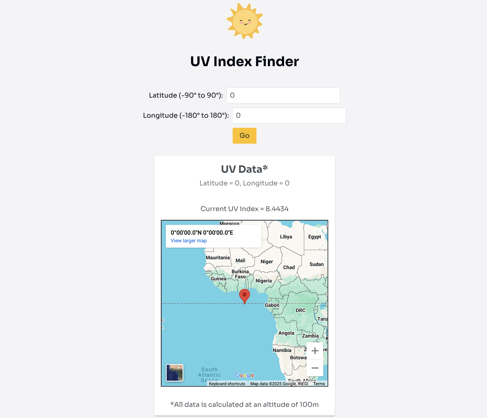

# UV Index Finder


A simple web app that displays the UV index at a specified location on earth. Built with React, TypeScript, and OpenUV.

## Screenshot


## Features
- Retrieves and displays the current UV index at the location specified
- Displays a map centred on entered latitude/longitude coordinates
- Marker shows the selected position
- Responsive design (desktop & mobile friendly)

## Tech Stack
- [React](https://react.dev/) - Frontend framework  
- [PrimeReact](https://primereact.org/) - UI components (input fields, buttons, cards)  
- [Google Maps Embed](https://developers.google.com/maps/documentation/embed) - Map display (read-only iframe)  
- [OpenUV API](https://www.openuv.io/) - UV index data source
- CSS (custom styling in `App.css`)

## Getting Started

You can set up this project in two ways: either by cloning it with Git or by downloading it as a ZIP file.  

### Option 1: Clone with Git

**1. Clone the repo**
```bash
git clone https://github.com/josiebrohm/uv-index-finder.git
```

**2. Change your working directory**
```bash
cd uv-index-finder
```

### Option 2: Download ZIP
**1. Download & Extract**
- Download ZIP (on GitHub, click the green **Code** button -> **Download ZIP**)
- Extract the ZIP file to a folder on your computer

**2. Open in a terminal**
```bash
cd uv-index-finder
```

### Common Steps (for both options)
**3. Install dependencies**
```bash
npm install
```

**4. Obtain a free API key**
Sign up at [OpenUV.io](https://www.openuv.io/) and create a free acount to generate an API key.

**5. Configure environment variables**
Create a .env file in the project root
```bash
REACT_APP_API_KEY=your_api_key
```

**6. Start the app**
```bash
npm start
```

## Usage
1. Open the app in your browser (http://localhost:3000)
2. Enter appropriate latitude and longitude values 
3. Click the **Go** button
4. The app will display a card with the following information:
	- the current UV index for the entered location
	- a map centred at the entered coordinates with a marker

## Planned Improvements
- Show UV safety recommendations based on index (e.g. "Use sun protection", "Stay indoors between 12:00 and 14:00")
- Allow users to select a location on the map and get the UV index
- Add dark/light mode option

## Author
Created by Josephine Bröhm